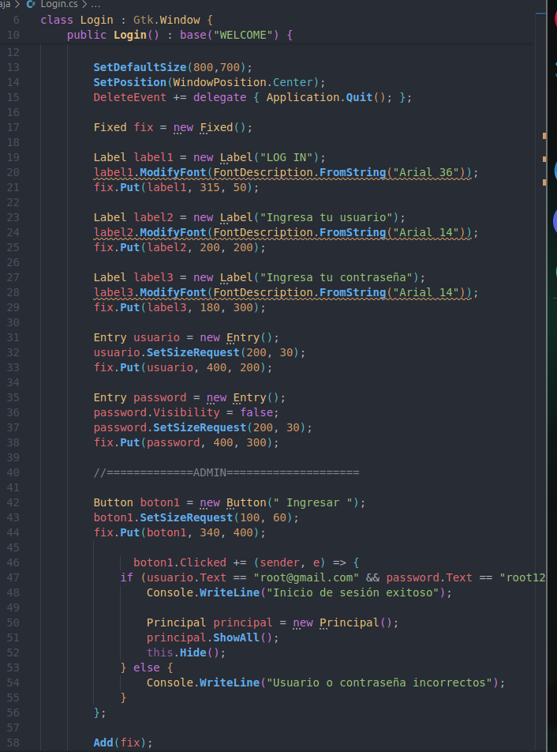
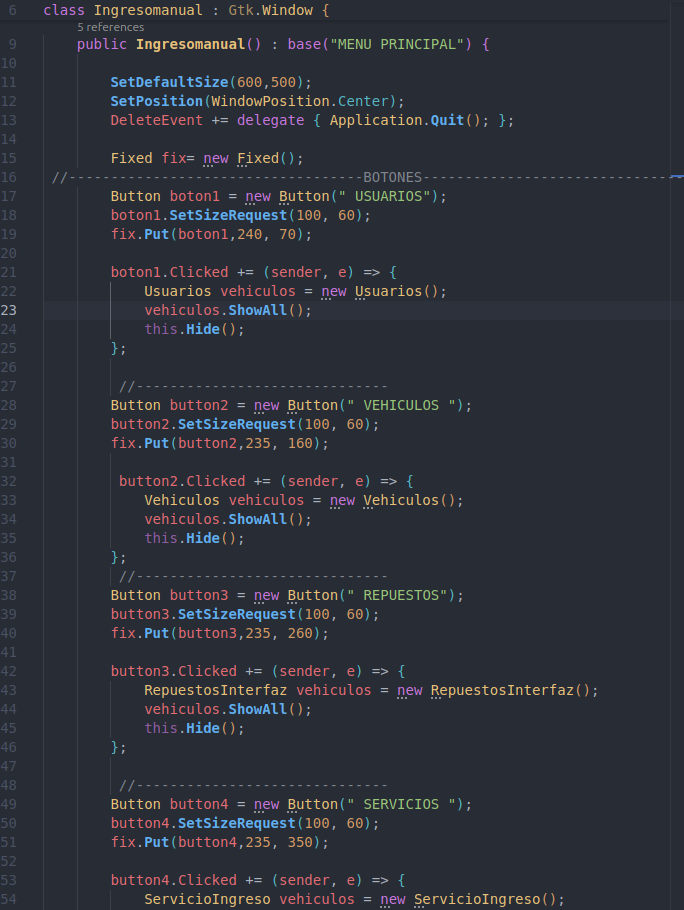
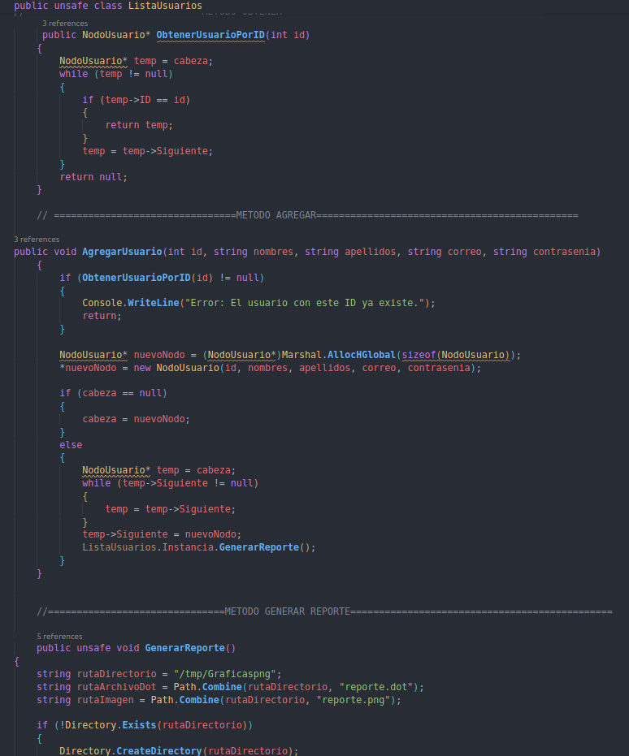
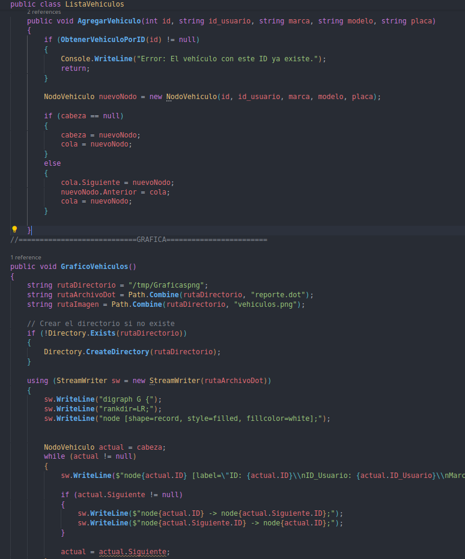
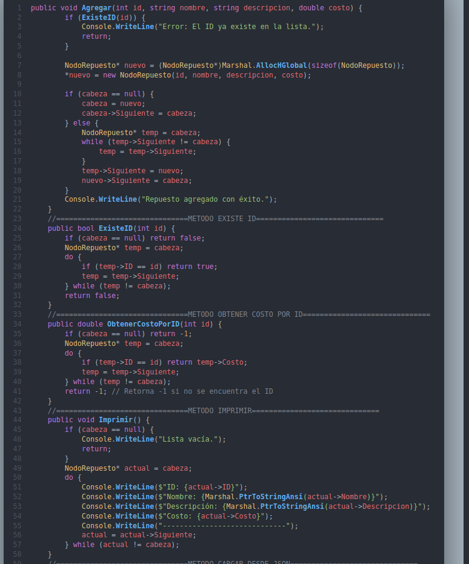
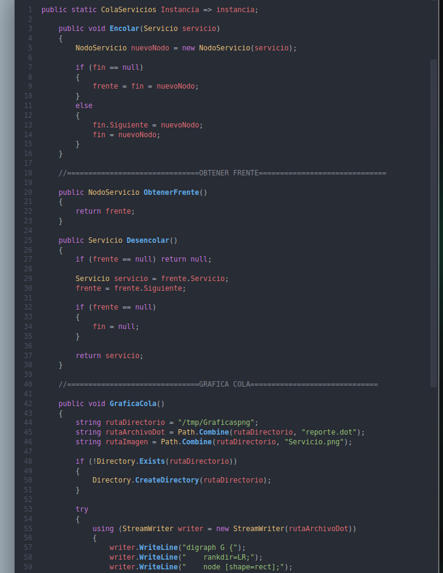
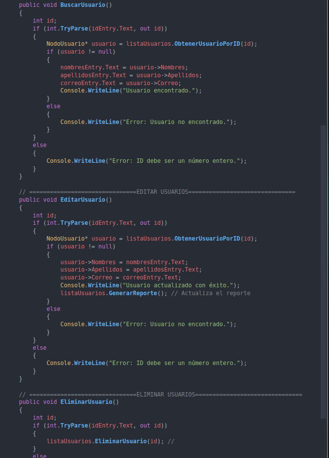
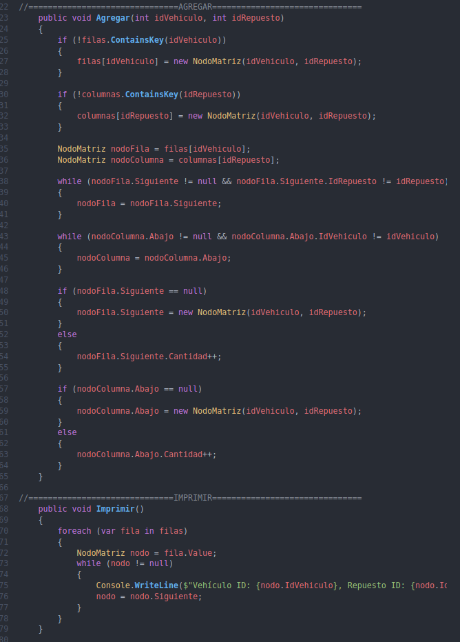
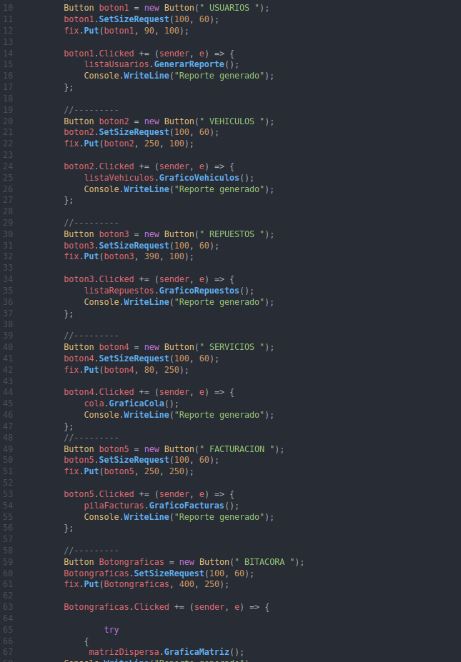

UNIVERSIDAD DE SAN CARLOS DE GUATEMALA FACULTAD DE INGENIERÍA ESTRUCTURAS DE DATOS CATEDRÁTICO: ING. ALVARO OBRAYAN HERNÁNDEZ GARCÍA
AUXILIAR: LUIS ENRIQUE GARCIA GUTIERREZ 

# MANUAL TECNICO
Axel Abraham Robles Soliz CARNÉ: 202307805 SECCIÓN: B GUATEMALA, 28 DE FEBRERO DEL 2,025

## INTRODUCCION
El desarrollo de un proyecto de programación implica entender cómo se realizó, incluyendo los pasos, técnicas y la lógica empleada para encontrar soluciones. La documentación es crucial en un proyecto, ya que brinda una descripción completa del programa, permitiendo a otros comprender cómo se creó y tal vez replicarlo utilizando tecnologías y metodologías nuevas.

Este manual detalla el funcionamiento del proyecto desarrollado en C# con una interfaz grafica creada con la libreria GTK, cubriendo la estructura del código, las características implementadas, las tecnologías empleadas y cualquier otra información relevante para trabajar con el proyecto de manera efectiva.

## OBJETIVOS
### OBJETIVO GENERAL
El objetivo del sistema es crear distintas estructuras de datos como pueden ser listas enlazadas simples, circulares, pilas, matriz dispersa,etc con la diferencia de implementar punteros con Unsafe en el lenguaje de programacion C#.

### OBJETIVOS ESPECIFICOS
Crear un proyecto donde pueda almacenar datos de distintos clientes, con estructuras de datos como pueden ser listas enlazadas, colas y pilas donde tambien se puedan generar Servicios con los datos almacenados de carros y usuarios, ademas de 
Implementar nuevos conocimientos sobre la matriz dispersa tanto en codigo y de manera grafica utilizando la herramienta "Graphiz".

## Alcance del Sistema
El propósito del manual técnico es proporcionar una descripción detallada de las consideraciones y pasos que el estudiante ha seguido al desarrollar el programa. Este manual está diseñado para ser útil tanto para expertos como para principiantes en el campo, permitiéndoles comprender el proceso de desarrollo y las decisiones tomadas durante la implementación. Al seguir las directrices y procedimientos descritos en el manual, los usuarios podrán replicar el programa, realizar mejoras y optimizar su eficiencia. El manual incluye información sobre la arquitectura del programa, la lógica utilizada, las herramientas empleadas, y los métodos de prueba y validación. Su objetivo es facilitar la comprensión y el uso del programa, promoviendo la colaboración y el avance en el desarrollo de soluciones similares.

## ESPECIFICACIÓN TÉCNICA
REQUISITOS DE HARDWARE Para la creación del programa se utilizó Visual Stude Code se utilizaron los siguientes requisitos: ■ 16 gigas de Ram ■ Procesador Intel Core i5 9300 + ■ 500 gigas en SSD ■ Gráfica NVIDIA 1650 ○ Es importante tener un equipo de calidad para una mejor experiencia a la hora de ejecutar el juego

# REQUISITOS DE SOFTWARE

Al comenzar en el mundo de la programación, es esencial contar con un editor de código fuente adecuado. En este caso, se utilizó Visual Studio Code para el desarrollo del programa en C#. Visual Studio Code es un entorno de desarrollo versátil que soporta diversos lenguajes de programación y proporciona herramientas útiles para la escritura, depuración y gestión del código. Aunque también existen otros editores como Apache NetBeans, Visual Studio Code ofrece una amplia gama de extensiones y características que facilitan el trabajo con Fortran, permitiendo un desarrollo más eficiente y una mejor integración con otras herramientas y bibliotecas.

## DESCRIPCION DE LA SOLUCION
El suigiente programa se realizo utilizando el lenguaje de programacion C# descargando el .Net de la version 6 o superior para poder trabajar en Linux y Windows sin ningun problema, Utilizamos la libreria GTK para realizar las interfaz grafica , tambien utilize la libreria pango para poder dar tamaño y ubicacion a las herramientas. 

primero realize toda la interfaz grafica y luego empeze con las estructuras de datos segun el dato, lista simple para usurios, doblemente enlazada para los vehiculos , circular para los respuestos , etc.

luego realize la carga masiva donde al leer los datos los envia a la lista enlazada correspondiente y asi almacenar sus datos , ademas validar si los ID ya existen y asi no poder crearlo, una vez  realizado los servicios y facturas correspondientes se utiliza la libreria "Graphiz" para ver los datos de manera grafica y tener un mejor control de los clientes.

# COMPONENTES CLAVE DE LA SOLUCION:

1. Primero realize todas interaces graficas para tener mi entorno de trabajo y poder iniciar con el codigo necesario.

2. Se realizo la Clase "USUARIOS" donde se realizo una lista simplemente enlazada utilizando punteros, lo cual se necesita ponder "UNSAFE" en las clases para poder utilizar dichos punteros, se crearon varios metodos en la clase como adregar , obtener usuario por id y generar usuario. Estos metodos son utilizes para adregar los datos y almacenarlos en la lista y asi poder buscar sus datos desde el ID.

3. Tambien se realizo la clase "Vehiculos" con una lista doblemente enlaza repitiendo los mismos metodos de usuario, para poder guardar los datos del vehiculo adregado pero valiando que el ID de usuario es existente.

4. Luego se realizo la clase "Repuestos" donde podre adregar respuestos para un vehiculo en especifico con metodos de "Adregar" , "Costo por ID", "Cargar desde json" que sirven para almancenar los datos desde la carga masiva , carga individual y almacenar su costo.

5. Una vez realizadas los datos anteriores , es el turno de realizar la clase "SERVICIOS" el cual esta hecho por medio de la estructura de datos "colas" donde valida que exista un ID de repuestos y el ID de vehiculos colocando una descripcion y precio del mismo.
en la clase estan los metodos de "obtenerFrenet" que es lo de hasta arriba de la cola y "Desencolar" que verifica si hay servicios y los va guardando
el ultimo que llega es el ultimo que se guarda.

6. Tambien esta la opcion de Editar los usuarios con los metodos de "BuscarUsuario" , "EditarUsuario" y "EliminarUsuario".

7. Crear la matriz dispersa para la relacion entre Servicios, Vehiculos y Repuestos.

8. Por ultimo paso  se genera el graphiz de cada dato como usuarios, vehiculos, repuestos, servicios, facturas, etc.
