UNIVERSIDAD DE SAN CARLOS DE GUATEMALA FACULTAD DE INGENIERÍA ESTRUCTURAS DE DATOS CATEDRÁTICO: ING. ALVARO OBRAYAN HERNÁNDEZ GARCÍA
AUXILIAR: LUIS ENRIQUE GARCIA GUTIERREZ 

# MANUAL DE USUARIO 
Axel Abraham Robles Soliz CARNÉ: 202307805 SECCIÓN: B GUATEMALA, 28 DE FEBRERO DEL 2,025

## OBJETIVOS DEL SISTEMA
### OBJETIVO GENERAL
El objetivo del sistema es crear distintas estructuras de datos como pueden ser listas enlazadas simples, circulares, pilas, matriz dispersa,etc con la diferencia de implementar punteros con Unsafe en el lenguaje de programacion C#.

### OBJETIVOS ESPECIFICOS DEL SISTEMA
Crear un proyecto donde pueda almacenar datos de distintos clientes, con estructuras de datos ,que quieran realizar un servicio a su vehiculo .

Implementar nuevos conocimientos sobre la matriz dispersa.

### INTRODUCCION
En informática y desarrollo de software, las estructuras de datos son formas de organizar y almacenar informacion en una computadora para utilizar dicha informacion de manera eficiente , ejemplos comunes son las listas, pilas ,colas , arboles , etc. Estas estructuras ayudan a mejorar el rendimiento del programa y al acceso de datos.

### INFORMACION DEL SISTEMA
El sistema tiene distintas maneras de recolectar informacion una de ellas es carga un archivo .json, que aparecera la opcion de si es Usuario, vehiculo o Repuesto, conteniendo su contenido en una estructura, tambien puedes adregar dichos datos de manera individual y asi poder editarlos mas adelantes.

al generar estos datos , puedes generar servicios para varios carros y por medio de graphiz ver dichos datos de manera grafica, esto sirve para tener un mejor control sobre los usuarios registrados junto con sus repuestos y servicios.

tambien se genera una factura para saber el total a pagar sumando los datos del servicio con el del repuesto.

### REQUISITOS DEL SISTEMA
Sistema Operativo. Para la instalación del programa utilizado se necesita Windows 10 o Windows 11. https://www.microsoft.com/es-es/software-download/windows10

DESCARGAR PROGRAMAS UTILIZADOS. Se debe instalar Visual Studio Code que nos servir como un editor de texto donde se puede trabajar con distintos lenguajes de programación entre ellos FORTRAN. Link para descargar Visual Studio Code: https://code.visualstudio.com

C-SHARP es un lenguaje de programación moderno, orientado a objetos. Se usa principalmente para crear aplicaciones en la plataforma .NET, como software de escritorio , aplicaciones web , videjuegos ,etc. Link para descargar: (https://dotnet.microsoft.com/es-es/)

EXTENCION EN VISUAL CODE Al momento de utilizar en Visual Studio Code es importante descargar su extensión para su correcto uso.
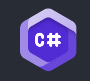

# FLUJO DE FUNCIONALIDADES DEL SISTEMA:

1. se inicia el programa y se tiene que poner el usuario y contraseña correspondiente para poder entrar.
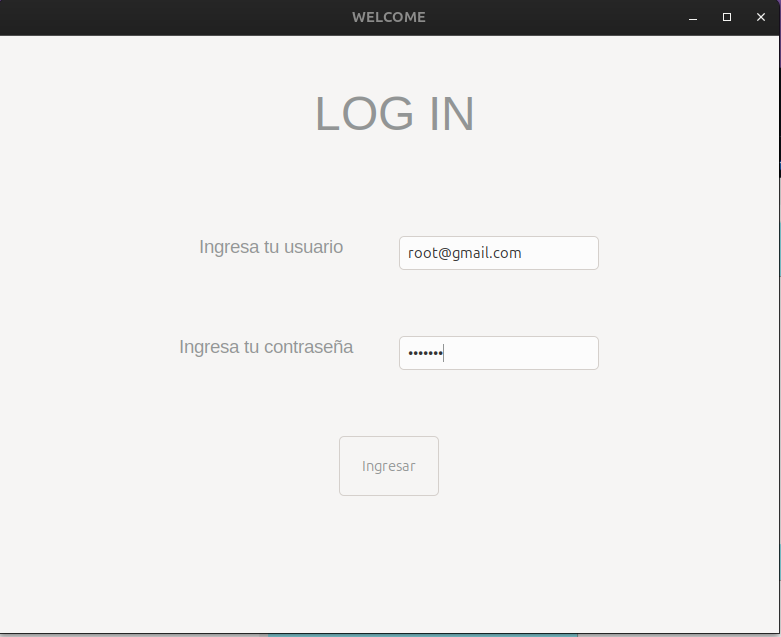

2. Se ingresa al menu principal donde podes elegir que funcion quieres realizar.
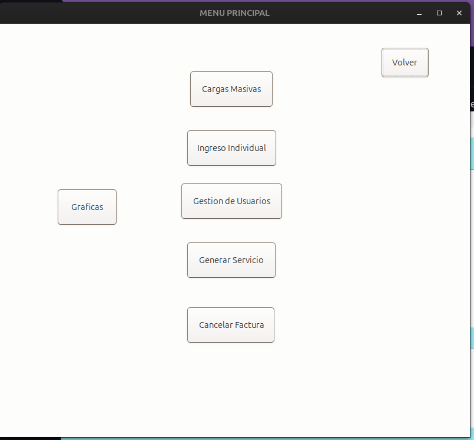

3.  Al seleccionar "Menu CARGA MASIVA" nos llevara a una pestaña donde podemos elegir si cargar un archivo.json de usuario , vehiculos o repuestos.
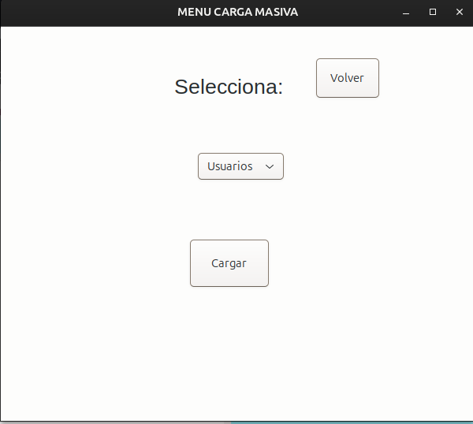
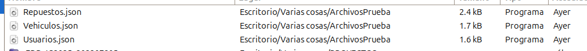

4. En la ventana "INGRESO INVIDUAL" accederemos a un menu donde podremos adregar individualmente un vehiculo, usuario, repuesto y servicio.
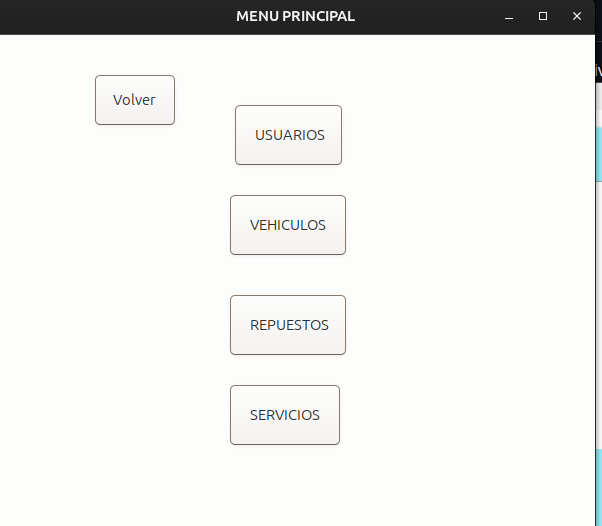

5. En cada una de las funciones podemos adregar una sin que se repida el ID.
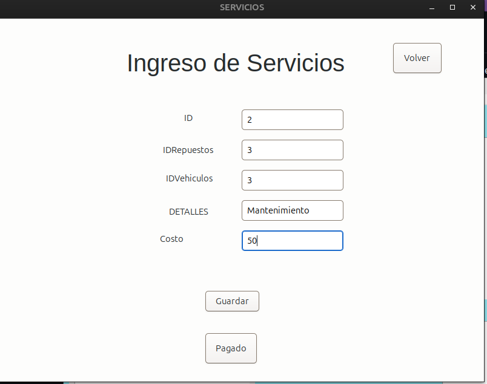

6. En "Gestion de Usuario" podemos elegir un usuario previamente registrado y podremos editar sus datos o eliminarlo de a lista.
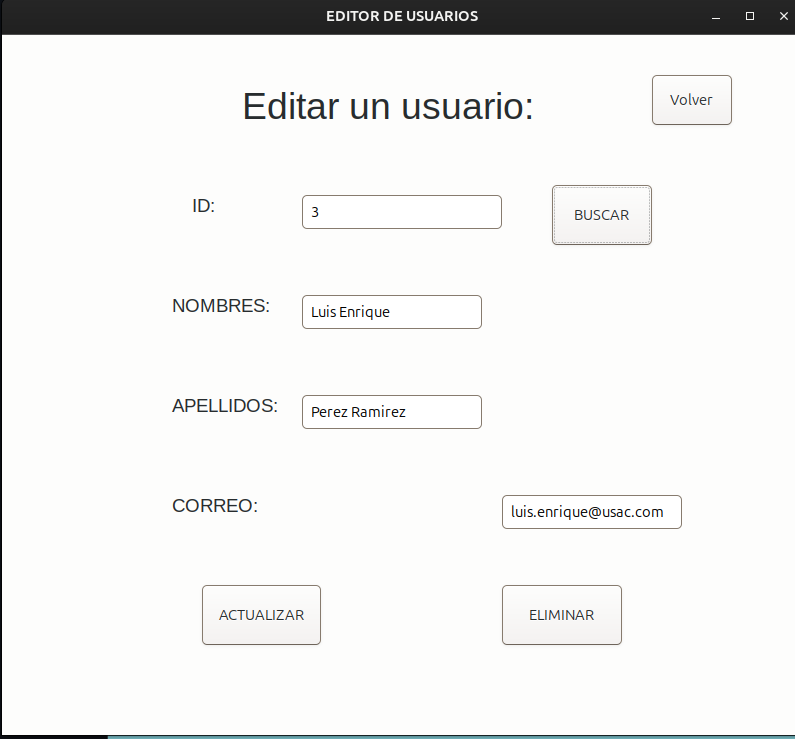

7. En "Generar un Servicio" podemos elegir directamente en la creacion de un servicio sin ir a la ventana de ingreso individual, ademas el boton de "Pagado" sirve para cancelar una factura cuando ya fue pagado su monto, se "quita de la pila" para poder ver la siguiente factura.
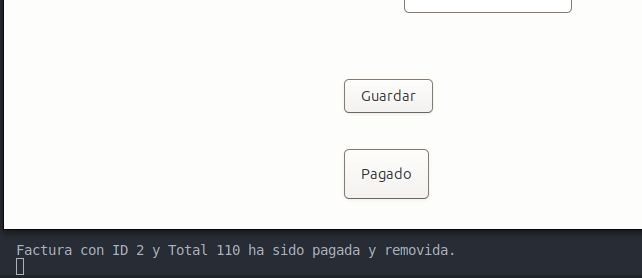

8. En la ventana "CANCELAR" podemos buscar una factura y ver el costo total del repuesto mas el servicio elegido.
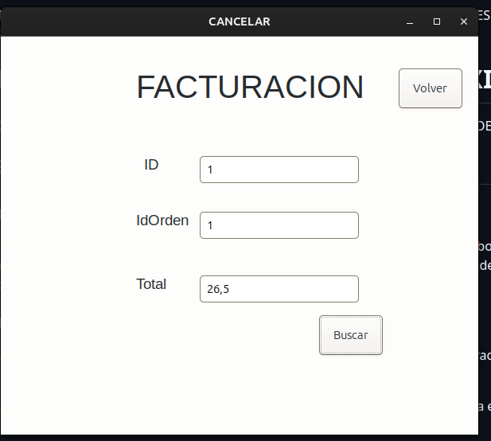

9. Como ultima Ventana seleccionamos "Graficas" que es donde podremos ver de manera grafica los datos que previamente hemos ingresado al sistema.
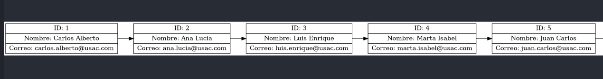
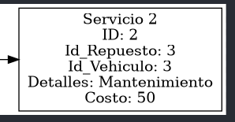
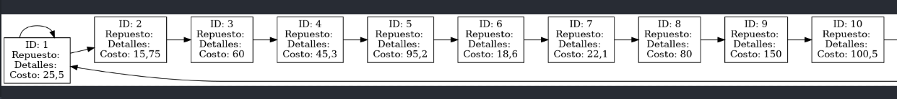

10. Como ultima funcion esta la ventana "TOPS" que mostrara un top de los 5 vehiculos mas antiguos junto al top de los vehiculos con mas servicios.
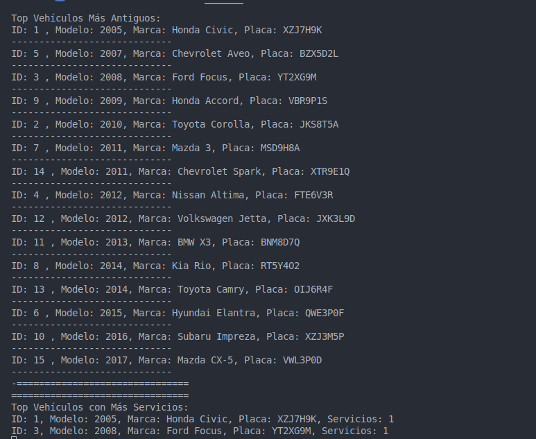